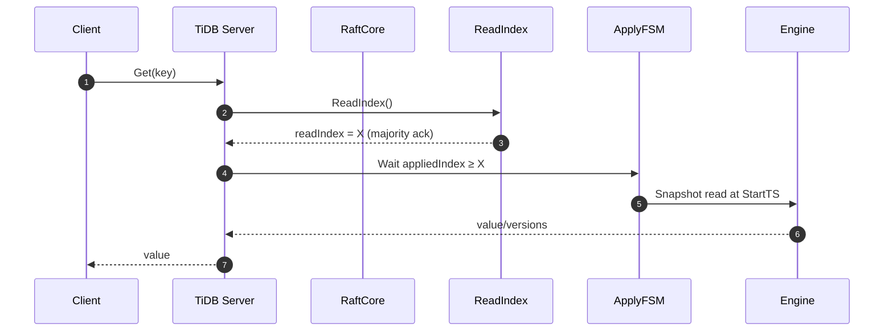

````markdown
# NyxDB: Distributed Transactional Storage Engine — Architecture Design (v0.1)

> **Audience**: Contributors, reviewers, and maintainers  
> **Scope**: Engineering-oriented design focusing on module responsibilities, public interfaces, data/control flow, reliability, and operability.  
> **Status**: Draft v0.1 (implementation-guiding)

---

## 0. Table of Contents

- [1. Goals & Non-Goals](#1-goals--non-goals)
- [2. High-level Architecture](#2-high-level-architecture)
- [3. Storage Engine Layer](#3-storage-engine-layer)
- [4. Raft Consensus Layer](#4-raft-consensus-layer)
- [5. Transaction Layer (Percolator-style MVCC)](#5-transaction-layer-percolator-style-mvcc)
- [6. PD / System Layer](#6-pd--system-layer)
- [7. Dataflows & Sequencing](#7-dataflows--sequencing)
- [8. Reliability & Recovery](#8-reliability--recovery)
- [9. Observability & Ops](#9-observability--ops)
- [10. Directory Layout](#10-directory-layout)
- [11. Test Strategy (unit/integration/chaos)](#11-test-strategy-unitintegrationchaos)
- [12. Roadmap & Extensibility](#12-roadmap--extensibility)
- [Appendix A. Core Interfaces (Go)](#appendix-a-core-interfaces-go)

---

## 1. Goals & Non-Goals

**Goals**
- Strongly consistent, replicated KV with **linearizable writes** and **read-after-commit linearizable reads**.
- **Transactional MVCC** with **Snapshot Isolation (SI)**; **optimistic** by default, **pessimistic** path for high-contention.
- Crash-safe engine (WAL + checksums + safe truncation) and **fast recovery** (snapshots).
- Operationally friendly: metrics, tracing, structured logs, chaos hooks.

**Non-Goals (v0.1)**
- Full SQL compatibility (planned), distributed joins/OLAP, secondary index optimizer.
- Cross-DC active-active replication (future CDC).
- Multi-tenant resource isolation beyond basic quota.

---

## 2. High-level Architecture

```mermaid
flowchart TB
  subgraph SQL[SQL Layer (future)]
    P[Parser/Planner]
    E[Executor]
  end

  subgraph TXN[Transaction Layer]
    TM[TxnManager]
    MV[MVCC Store]
    LR[Lock Resolver]
    GC[GC Worker]
    TSO[TSO Client]
  end

  subgraph RAFT[Raft Consensus Layer]
    RC[RaftCore]
    RS[RaftStorage]
    RI[ReadIndex]
    SS[Snapshotter]
    AF[ApplyFSM]
  end

  subgraph ENG[Storage Engine]
    WAL[WAL / LogSegments]
    KD[KeyDir]
    MC[Merger/Compactor]
    VS[Versioned KV]
  end

  subgraph SYS[System/PD]
    PD[Placement Driver: TSO, Metadata]
    SVC[gRPC/API, Admin, Metrics]
  end

  E --> TM
  TM <--> MV
  TM <--> LR
  TM -->|Prewrite/Commit| RC
  RC --> RS
  RC --> RI
  RC --> SS
  AF --> ENG
  PD <-->|TSO/Meta| TM
  SVC --> TM
````

**Layering principles**

* **Engine** is crash-safe KV + MVCC primitives.
* **Raft** replicates *operations* and ensures group consistency; snapshots compact history.
* **Txn** maps SQL/KV semantics to MVCC + 2PC over Raft, using **global timestamps** (TSO).
* **PD/System** provides **TSO**, cluster metadata, and admin surfaces.

---

## 3. Storage Engine Layer

**Responsibilities**

* Append-only **WAL** with CRC; segment management; safe scanning/truncation.
* **Bitcask-like** datafiles + **KeyDir** (key → {fid, offset, size}) + **MVCC chain** (commit_ts, prev).
* Background **merge/compaction**: reclaim tombstones & old versions; snapshot pinning.

**Key design**

* Record encoding: `CRC | TYPE+metaFlag | varint keyLen | varint valLen | [meta uvarint/varint: commitTs, prevFid, prevOff] | key | value`.
* CRC covers from TYPE to end; header max size bounded; defensive decoding (n>0 + size upper bounds).
* **Atomic append** + **fdatasync policy** (per op / interval / batch), configurable.

**Engine invariants**

* WAL before data visibility.
* On restart: scan segments → verify CRC → rebuild KeyDir → reconcile with last snapshot.

---

## 4. Raft Consensus Layer

**Responsibilities**

* Leader election, log replication, **majority commit**, **apply** to state machine.
* **ReadIndex** linearizable reads; **lease read** (optional fast path) with term checks.
* **Snapshots**: create/apply with `(lastIncludedIndex, term, checksum)` and **truncate** old logs.

**Storage**

* `RaftStorage` persists: `HardState`, `Entries`, `SnapshotMeta`.
* Safe ordering: state machine changes and raft persistence produce **crash-consistent points**.

**Follower catch-up**

* Prefer AppendEntries; if lag is large → **InstallSnapshot** (chunked, resumable).

---

## 5. Transaction Layer (Percolator-style MVCC)

**Model**

* Global timestamps via PD **TSO**.
* **Optimistic** default:
  `StartTS → Prewrite (locks+values) → CommitTS (primary first) → secondary async commit`.
* **Pessimistic** mode for hot rows: acquire row lock first (2PL) to reduce aborts.

**Visibility**

* Snapshot reads at `StartTS` view only versions with `CommitTS ≤ StartTS`.
* Lock resolver handles lock wait / rollback of abandoned locks.

**Conflict**

* Prewrite checks for conflicting locks/commits; on conflict → backoff + retry (optimistic), or wait (pessimistic).

---

## 6. PD / System Layer

**PD (Placement Driver)**

* **TSO** service (monotonic, globally unique).
* Cluster membership, region metadata (v0.1 single-group; sharding in roadmap).
* Health/lease tracking (for future balancing).

**System**

* gRPC APIs: KV/Txn/Admin; structured logs; **Prometheus** metrics; **OpenTelemetry** tracing.
* Chaos hooks (fault injection) at IO, network, timing boundaries.

---

## 7. Dataflows & Sequencing

### 7.1 Write (Txn Commit) Path

```mermaid
sequenceDiagram
  autonumber
  participant C as Client
  participant TM as TxnManager
  participant RC as RaftCore
  participant RS as RaftStorage
  participant AF as ApplyFSM
  participant EN as Engine

  C->>TM: Begin(StartTS)
  TM->>TM: Buffer mutations (Put/Del)
  TM->>RC: Prewrite (primary + secondaries)
  RC->>RS: Append entries (Prewrite ops)
  RC-->>RC: Replicate to majority
  RC->>AF: Commit index advances → Apply Prewrite
  AF->>EN: WAL append; write lock/value
  TM->>PD: Request CommitTS
  TM->>RC: Commit(primary, CommitTS)
  RC->>RS: Append Commit entry
  RC-->>RC: Majority commit
  RC->>AF: Apply Commit
  AF->>EN: Mark committed; unlock
  TM-->>C: OK (secondaries commit async)
```

### 7.2 Read (Linearizable)



### 7.3 Snapshot & Truncation

```mermaid
flowchart LR
  A[appliedIndex >= threshold] --> B[Snapshotter.Dump()]
  B --> C[Persist snapshot + checksum]
  C --> D[Update SnapshotMeta(lastIncludedIndex)]
  D --> E[RaftStorage.Compact(lastIncludedIndex)]
  E --> F[Delete/Truncate old log segments]
```

---

## 8. Reliability & Recovery

**Crash safety**

* **WAL** with CRC; partial write detection; safe truncation to last valid offset.
* **Snapshot atomicity**: write `.tmp` + checksum → rename; never truncate logs until snapshot is durable.

**Recovery on restart**

1. Load latest valid snapshot (verify magic/version/checksum).
2. Rebuild KeyDir (or load engine manifest).
3. Replay remaining raft entries from `lastIncludedIndex+1`.
4. Resolve dangling locks (primary-driven).

**Quorum safety**

* Only majority-committed entries are applied; old leaders reject writes.

---

## 9. Observability & Ops

**Metrics (Prometheus)**

* Engine: `engine_wal_fsync_seconds`, `engine_compaction_bytes`, `active_snapshots`.
* Raft: `raft_commit_index`, `raft_apply_index`, `raft_replication_lag`, `snapshot_install_seconds`.
* Txn: `txn_conflict_total`, `lock_wait_seconds`, `tso_latency_seconds`.
* System: `grpc_inflight`, `panic_recover_total`.

**Logs**

* Structured (zap), request/entry ids, term/index, file:offset.
* Redaction-safe logging for data.

**Tracing**

* Spans: `tso`, `prewrite`, `commit`, `replicate`, `apply`, `wal_fsync`.

**Admin**

* gRPC/Admin: `Compact()`, `ForceSnapshot()`, `TransferLeader()`, `DebugDump()`.

---

## 10. Directory Layout

```
NyxDB/
├─ cmd/
│  └─ nyxdbd/                 # server main
├─ internal/
│  ├─ engine/                 # storage engine
│  │  ├─ wal/                 # WAL impl, segments, scanner
│  │  ├─ keydir/              # in-memory index + persistence
│  │  ├─ mvcc/                # version chain, readers/writers
│  │  ├─ compaction/          # merge/GC scheduler
│  │  └─ snapshot/            # engine snapshot dump/restore
│  ├─ raft/
│  │  ├─ core/                # Raft state machine
│  │  ├─ storage/             # HardState/Entries/Snapshot meta
│  │  ├─ readindex/           # linearizable read
│  │  └─ transport/           # RPC (gRPC)
│  ├─ txn/
│  │  ├─ manager/             # TxnManager, session
│  │  ├─ percolator/          # prewrite/commit, primary/secondary
│  │  ├─ lock/                # lock table & resolver
│  │  ├─ gc/                  # mvcc garbage collection
│  │  └─ tso/                 # PD TSO client
│  ├─ pd/                     # PD client (TSO, meta) & mocks
│  ├─ server/                 # gRPC services, admin, auth
│  ├─ conf/                   # configuration
│  ├─ metrics/                # prometheus collectors
│  ├─ tracing/                # OpenTelemetry setup
│  └─ chaos/                  # fault injection hooks
├─ pkg/                       # reusable types/errors
├─ docs/
│  └─ design/                 # this file + diagrams
├─ test/
│  ├─ unit/                   # go test unit suites
│  ├─ integration/            # docker-compose clusters
│  └─ jepsen/                 # jepsen harness (optional)
└─ tools/
   └─ bench/                  # load generators
```

---

## 11. Test Strategy (unit/integration/chaos)

**Unit tests**

* Engine: record encode/CRC, varint fuzz, WAL scan/truncate, snapshot dump/restore.
* Txn: visibility matrix (`StartTS` vs `CommitTS`), lock wait/timeout, conflict detection.
* Raft: ready/apply cycle, snapshot compaction boundaries.

**Integration tests (docker-compose, 3–5 nodes)**

* Linearizable reads while writing (ReadIndex gate).
* Leader failover under load; secondary catch-up.
* Snapshot creation/install; space reclaim.

**Chaos tests (recommended via Chaos Mesh / Jepsen)**

* Kill -9 leader during prewrite/commit.
* Network partition (isolate leader from majority).
* Disk partial write & corruption (engine detects & truncates).
* Clock skew for clients (TSO ensures monotonicity on server side).

**Verification**

* KV checksum across replicas; periodic range scan compare.
* Raft invariants: single leader, commit index monotonic.
* Txn invariants: no lost update under SI, write atomicity.

---

## 12. Roadmap & Extensibility

**Near-term**

* Pessimistic transactions; lock manager fairness & deadlock detector.
* Incremental snapshots; snapshot compression (zstd).
* Raft pipeline replication; coalesced ReadIndex.

**Mid-term**

* Region sharding (multi-Raft); PD placement policies.
* SQL layer (parser/planner/executor) with secondary indexes.
* CDC stream for change data capture; backup/restore.

**Long-term**

* Multi-tenant quotas; tiered storage; cloud-native operator.

---

## Appendix A. Core Interfaces (Go)

> *Representative signatures for cross-module contracts. Concrete types may evolve.*

```go
// ------------ Engine Layer ------------
type Engine interface {
    Get(key []byte, ts uint64) (val []byte, ok bool, err error) // snapshot read at ts
    Put(key, val []byte, ts uint64) error                       // write version (via Apply)
    Delete(key []byte, ts uint64) error
    NewIterator(rangeStart, rangeEnd []byte, ts uint64) (Iterator, error)
    SnapshotCreate(appliedIdx, term uint64) (SnapshotMeta, error)
    SnapshotRestore(meta SnapshotMeta, r io.Reader) error
}

type SnapshotMeta struct {
    Index    uint64
    Term     uint64
    Size     uint64
    Checksum uint32
    Path     string
}

// ------------ Raft Layer ------------
type RaftNode interface {
    Propose(ctx context.Context, data []byte) error
    ReadIndex(ctx context.Context) (uint64, error)
    Ready() <-chan Ready
    Advance()
    Stop()
}

type Ready struct {
    Entries          []Entry
    CommittedEntries []Entry
    Snapshot         *SnapshotMeta
    Messages         []Message
    HardState        HardState
}

type ApplyFSM interface {
    // Apply a committed Raft entry to the engine (idempotent).
    Apply(entry Entry) error
    // Snapshot/Restore called by snapshotter.
    Snapshot(meta SnapshotMeta, w io.Writer) error
    Restore(meta SnapshotMeta, r io.Reader) error
}

// ------------ Transaction Layer ------------
type TxnManager interface {
    Begin(ctx context.Context) (*Txn, error) // obtains StartTS from TSO
}

type Txn struct {
    StartTS  uint64
    Mode     TxnMode // optimistic or pessimistic
}

type TxnMode int

const (
    TxnOptimistic TxnMode = iota
    TxnPessimistic
)

func (t *Txn) Get(ctx context.Context, key []byte) ([]byte, error)
func (t *Txn) Set(ctx context.Context, key, val []byte) error
func (t *Txn) Delete(ctx context.Context, key []byte) error
func (t *Txn) Commit(ctx context.Context) error
func (t *Txn) Rollback(ctx context.Context) error

// ------------ PD / TSO ------------
type TSO interface {
    Now(ctx context.Context) (uint64, error) // monotonic, globally unique
}

// ------------ Lock Resolver ------------
type LockResolver interface {
    ResolveLock(ctx context.Context, key []byte, startTS uint64) error
}
```

---

## Change Log

* **v0.1**: Initial engineering-oriented architecture document with diagrams, interfaces, layout, and testing guidance.

---

```
```
